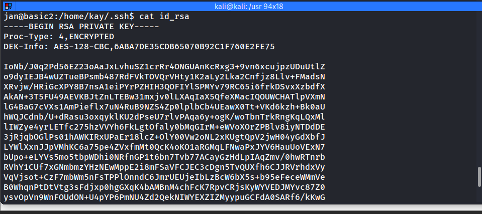
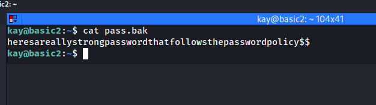

Starting with the Nmap scan

What is the name of the hidden directory on the web server(enter name without /)?

What is the username?

What is the password?
 

What service do you use to access the server(answer in abbreviation in all caps)?
SSH

What is the name of the other user you found(all lower case)?
Kay

Enumerate the machine to find any vectors for privilege escalation

