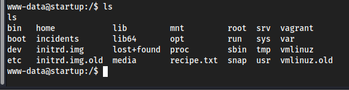

Starting with a nmap scan 

we found that Ftp anonymous login is allowed so let's login with ftp

we've got some files in ftp
let's try to read those files 

since port 80 is open let's open our ip in web browser too 

meanwhile let's run a gobuster scan to find the directories

the files contains same things like ftp 

let's us put our reverse shell  file in FTP and access that in browser to get shell access

We've got a shell here

let's explore the shell

we got a txt file here

We can’t get in Lennie’s directory so we need to find a way onto their account. When we listed the files earlier there was a directory called “incidents”, let’s see what’s there.

This file might contain something we need. Let’s copy it to the /files/ftp directory so we can access it and check it out in Wireshark. We’ll use the following command to do this:

If we right-click on a packet and select Follow > TCP Stream, we can observe some actions being performed on the target machine in streams two and seven. In stream seven, sudo commands are being entered as the user `www-data`, along with an incorrect password. Let's try using this password for the user Lennie.

yay! now we logged into use lennie

The output file is created by root! This means that root is running an automated task that runs the planner.sh script every minute. Now we can edit the print.sh script to get us a root shell instead of creating an output file.

and we got root access 

